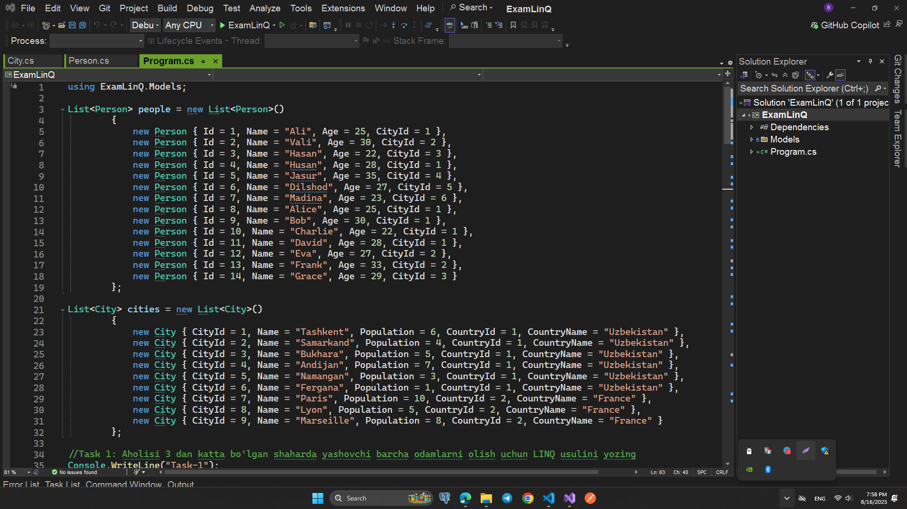
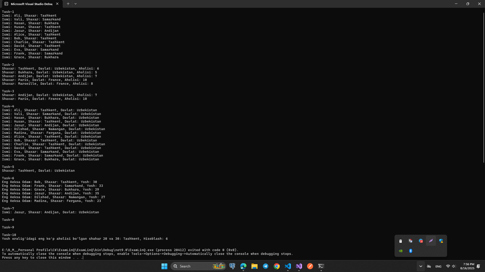

# LINQ Imtihon Vazifalari

Ushbu repository LINQ yordamida bajariladigan imtihon vazifalarini o'z ichiga oladi. Har bir vazifa alohida servisda amalga oshirilgan, bu esa kodni tartibli va tushunarli qiladi.

---

## Vazifalar ro‘yxati

### Vazifa 1

**Maqsad:** Aholisi 3 milliondan oshgan shaharlarda yashovchi barcha odamlarni topish.

### Vazifa 2

**Maqsad:** Har bir mamlakatdagi o'rtacha aholi sonidan yuqori aholi yashaydigan barcha shaharlarni topish.

### Vazifa 3

**Maqsad:** Har bir mamlakatdagi eng katta aholiga ega shaharlarni olish.

### Vazifa 4

**Maqsad:** Barcha odamlarni ularning shaharlari va mamlakat nomlari bilan birga olish.

### Vazifa 5

**Maqsad:** Nomi "Alice" bo'lgan (katta-kichik harflardan qat'iy nazar) odam yashaydigan barcha shaharlarni topish.

### Vazifa 6

**Maqsad:** Har bir shaharda eng keksa odamni topish.

### Vazifa 7

**Maqsad:** Har bir mamlakatdagi eng ko'p aholiga ega shaharlarida yashovchi odamlarni topish.

### Vazifa 8

**Maqsad:** Belgilangan uzunlikdagi nomga ega shaharlarda yashovchi odamlarni topish.

### Vazifa 9

**Maqsad:** Har bir mamlakatdagi eng yosh odamni topish.

### Vazifa 10

**Maqsad:** Belgilangan yosh oralig'idagi odamlar soni eng ko'p bo'lgan shaharni topish.

---

## Ma`lumotlar

## Natijalar:

