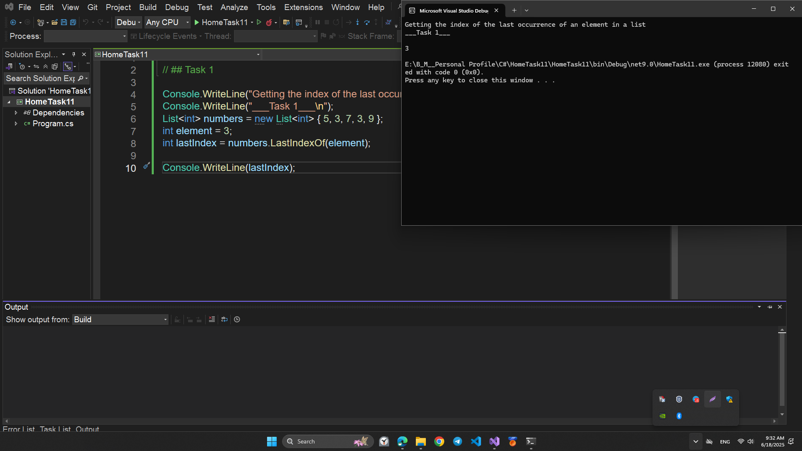
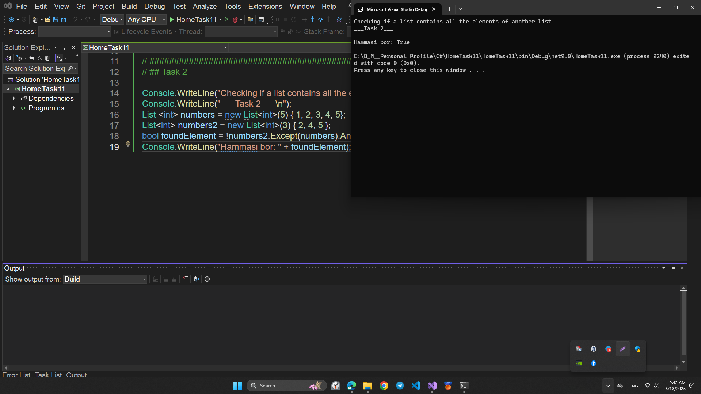
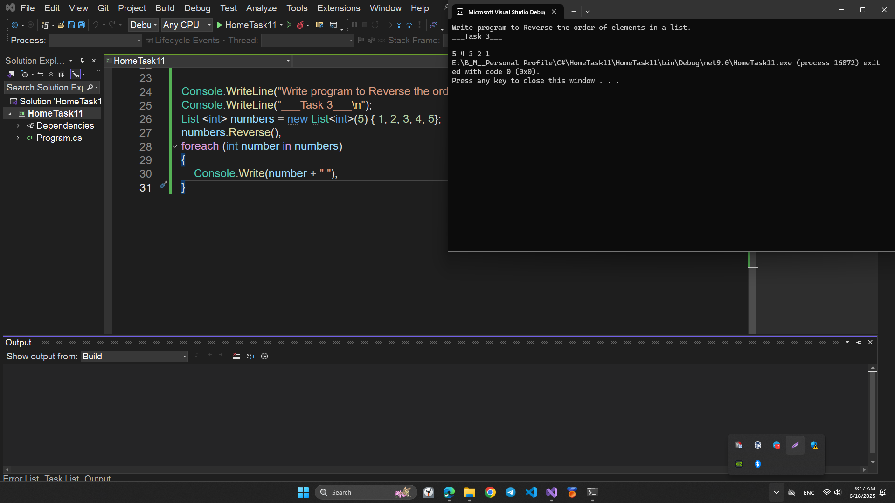
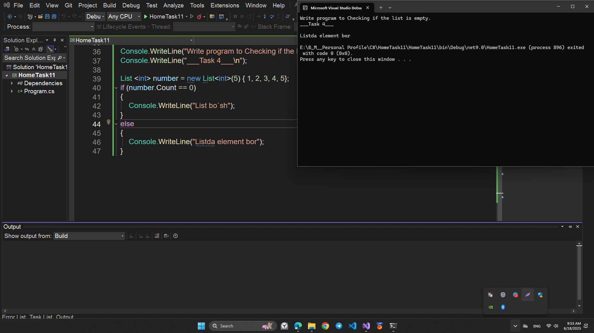
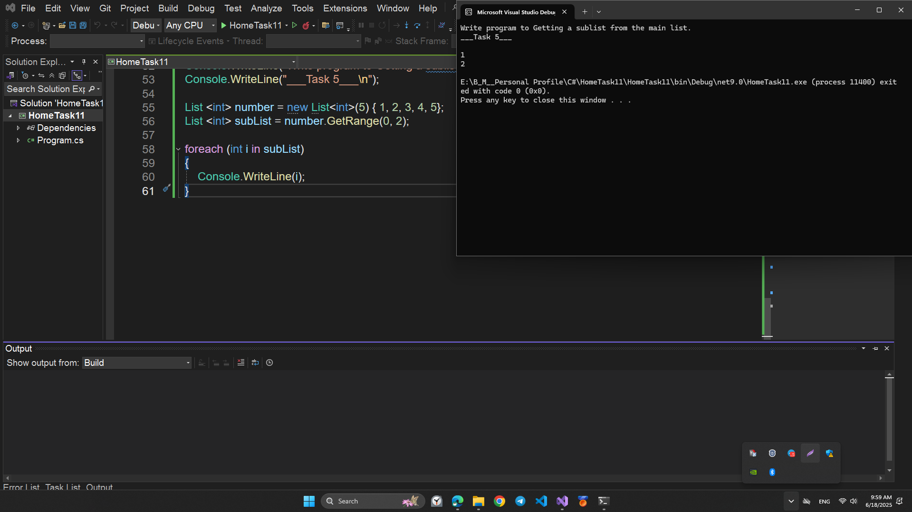
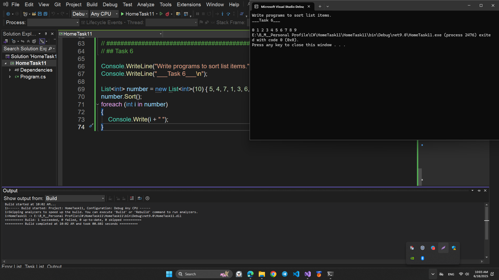
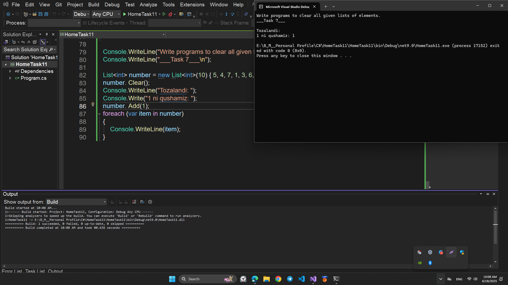
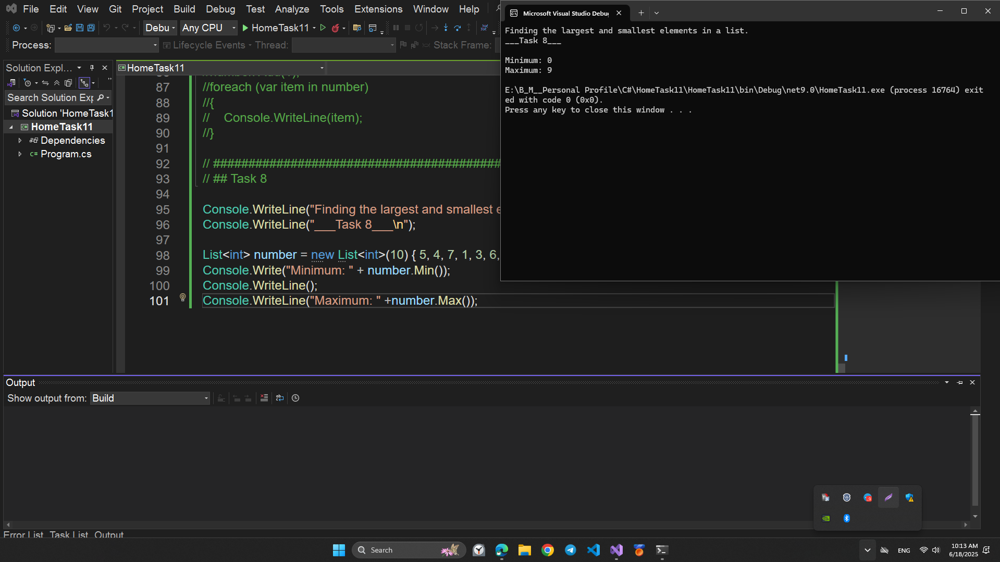
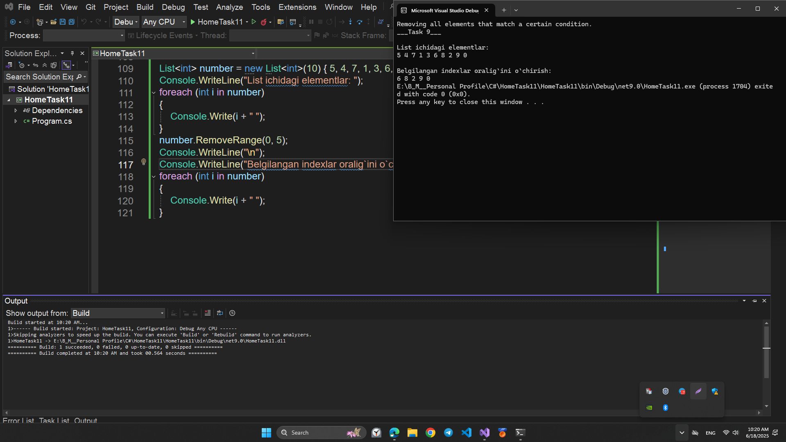
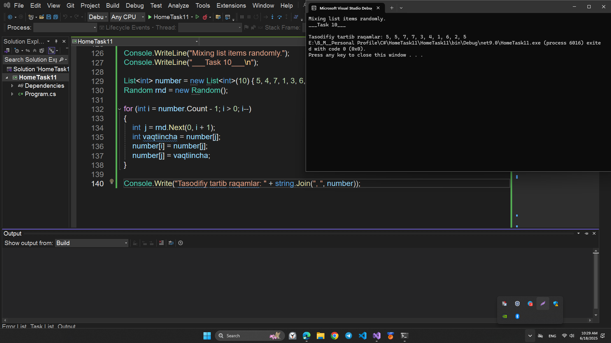

# HomeTask11

## This program is written in C# and performs the following function:

## COLLECTIONS

# Topics

```
1. C# COLLECTIONS
2. C# LIST<T>
```

# Program performance

## Task1

## - Getting the index of the last occurrence of an element in a list.

## 💻 Sample Code Screenshot



## Task2

## - Checking if a list contains all the elements of another list.

## 💻 Sample Code Screenshot



## Task3

## - Write program to Reverse the order of elements in a list.

## 💻 Sample Code Screenshot



## Task4

## - Write program to Checking if the list is empty.

## 💻 Sample Code Screenshot



## Task5

## - Write program to Getting a sublist from the main list.

## 💻 Sample Code Screenshot



## Task6

## - Write programs to sort list items.

## 💻 Sample Code Screenshot



## Task7

## - Write programs to clear all given lists of elements.

## 💻 Sample Code Screenshot



## Task8

## - Finding the largest and smallest elements in a list.

## 💻 Sample Code Screenshot



## Task9

## - Removing all elements that match a certain condition.

## 💻 Sample Code Screenshot



## Task10

## - Mixing list items randomly.

## 💻 Sample Code Screenshot


