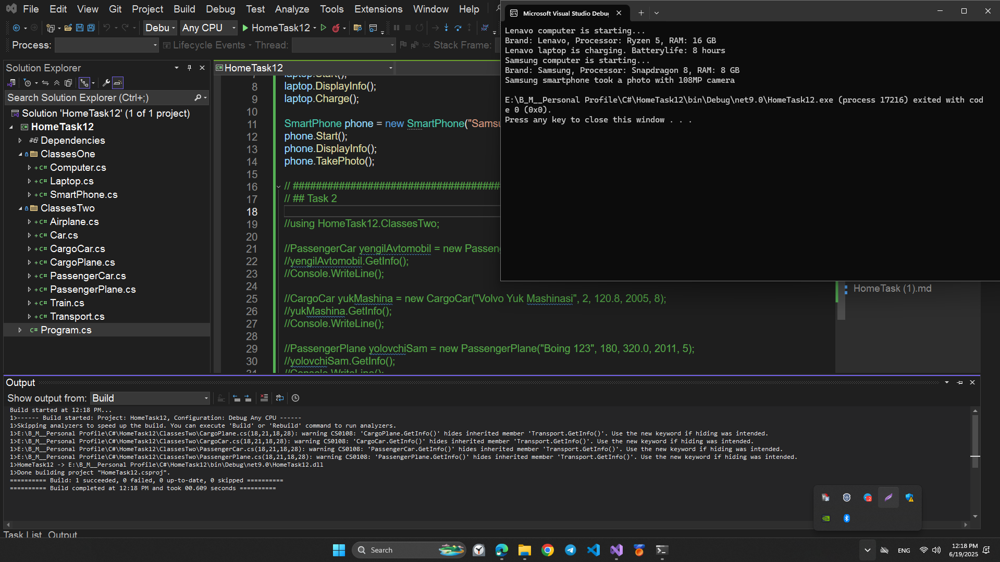
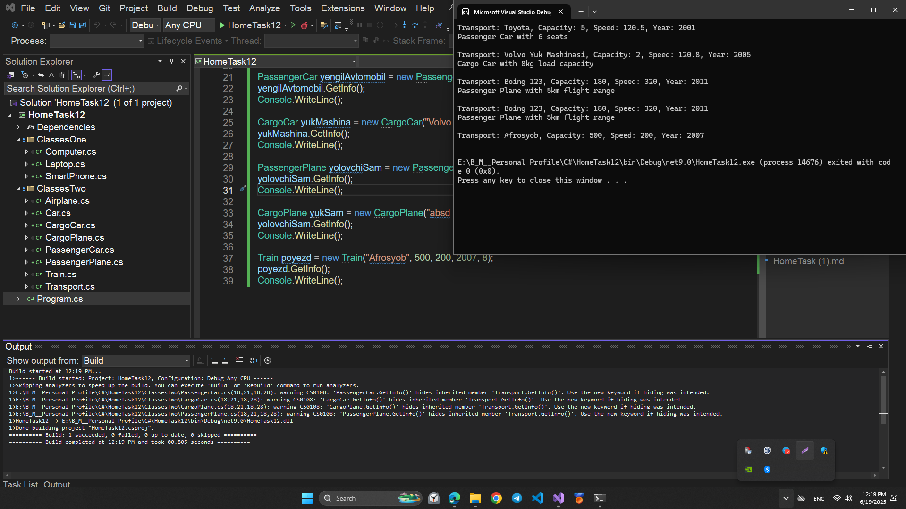

# HomeTask12

## This program is written in C# and performs the following function:

## INHERITANCE

# Topics

```
1. C# INHERITANCE
2. C# KEYWORD BASE
3. C#  SYSTEM.OBJECT CLASS
```

# Program performance

## Task1

# - Create three classes : `Computer`, `Laptop`, and `SmartPhone`.

## Remember to add properties and methods to your diagram.

1. For the parent class `Computer` add:

   - 3 fields
   - 2 methods
   - a constructor

2. For the child class `Laptop` or `SmartPhone`, add at least:

   - 1 additional field
   - 1 additional method

3. The child constructor should send data to the parent class.

## 💻 Sample Code Screenshot



## Task2

1. Create a base class called `Transport`. Inherit from it to create classes called `Car` `Airplane`, and `Train`.  
   Inherit from the `Car` class to create classes called `PassengerCar` and `CargoCar`. Inherit from the `Airplane` class to create classes called `CargoPlane` and `PassengerPlane`.
2. Define properties for the base class and add properties to the derived classes that specifically characterize the objects of the derived classes.

3. Define constructors and methods to populate the properties. Write a method that displays information about the type of transport and its characteristics.

## 💻 Sample Code Screenshot


