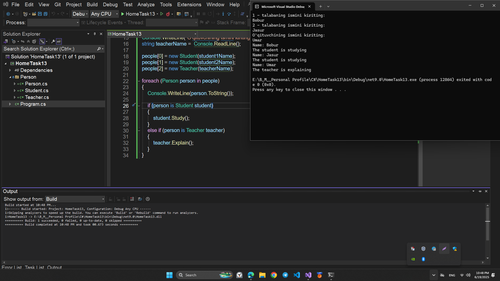
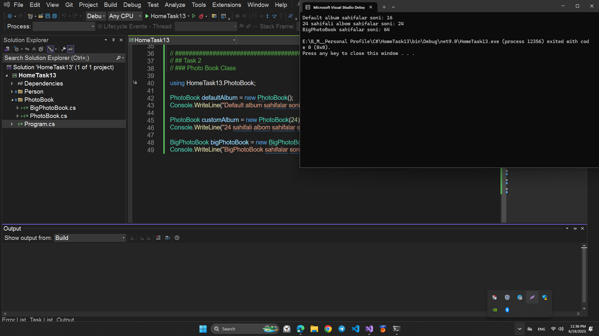
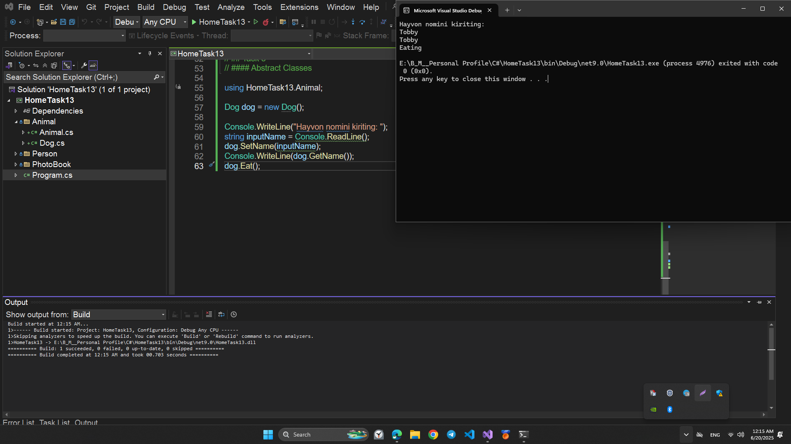

# HomeTask13

## This program is written in C# and performs the following function:

## POLYMORPHISM

# Topics

```
1. C# POLYMORPHISM
2. C# VIRTUAL METHODS
3. C# ABSTRACT CLASS
4. C# ABSTRACT METODS
```

# Program performance

## Task1

### Inheritance of Objects

Create a C# program that prompts the user for three names of people and stores them in an array of `Person`-type objects.  
There will be two people of the `Student` type and one person of the `Teacher` type.

To do this, follow the steps below:

1. Create a `Person` class with the following:

   - A `Name` property of type string
   - A constructor that receives the name as a parameter
   - Override the `ToString()` method

2. Create two more classes that inherit from the `Person` class:

   - `Student` class:
     - Has a `Study` method that writes `The student is studying` to the console
     - Create a constructor in the `Student` class that calls the parent constructor of the `Person` class
   - `Teacher` class:
     - Has an `Explain` method that writes `The teacher is explaining` to the console
     - Create a constructor in the `Teacher` class that calls the parent constructor of the `Person` class

3. In the main program:

   - Prompt the user for the names of three people and store them in an array of `Person` objects
   - Invoke the `Explain` method for the teacher object
   - Invoke the `Study` method for the student objects

## 💻 Sample Code Screenshot



## Task2

### Photo Book Class

Create a C# program to manage a photo book using object-oriented programming.
To start, create a class called `PhotoBook` with a private attribute `numPages` of type `int`.
It must also have a public method `GetNumberPages()` that will return the number of photo book pages.  
The default constructor will create an album with 16 pages.  
There will also be an additional constructor that allows us to specify the number of pages we want in the album.
There is also a `BigPhotoBook` class whose constructor will create an album with 64 pages.
Finally, create a `PhotoBookTest` class to perform the following actions:

1. Create a default photo book and display the number of pages.
2. Create a photo book with 24 pages and display the number of pages.
3. Create a large photo book and display the number of pages.

## 💻 Sample Code Screenshot



## Task3

### Abstract Classes

Create a C# program that implements an abstract class `Animal` that has a `Name` property of type text and three methods:  
`SetName(string name)`, `GetName()`, and `Eat()`. The `Eat()` method will be an abstract method of type void.
You will also need to create a `Dog` class that implements the `Animal` class mentioned above,  
 and override the `Eat()` method to display that the dog is eating.  
To test the program, ask the user for a dog's name and create a new `Dog` object from the `Main` method of the program. Set the name of the `Dog` object and then execute the `GetName()` and `Eat()` methods.

## 💻 Sample Code Screenshot


