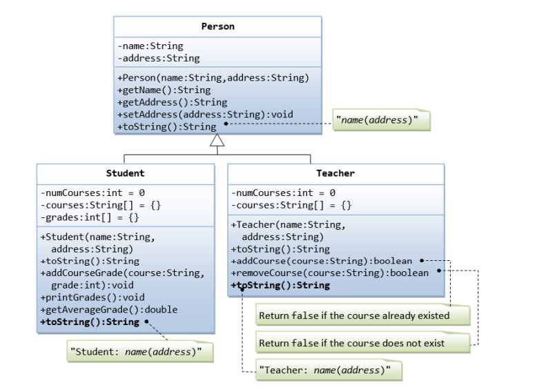

# HomeTask14

## This program is written in C# and performs the following function:

## POLYMORPHISM

# Topics

```
1. C# POLYMORPHISM
2. C# VIRTUAL METHODS
3. C# ABSTRACT CLASS
4. C# ABSTRACT METODS
```

# Program performance

## Task1

### Inheritance: Superclass Person and its Subclasses

Suppose that we are required to model students and teachers in our application.



- We can define a superclass called `Person` to store common properties such as name and address, and subclasses `Student` and `Teacher` for their specific properties.

- For students, we need to maintain the courses taken and their respective grades.

- We should be able to add a course with a grade, print all courses taken, and calculate the average grade.

- We assume that a student takes no more than 30 courses throughout the program.

- For teachers, we need to maintain the courses currently taught and be able to add or remove a course taught.
- We assume that a teacher teaches no more than 5 courses concurrently.

## 💻 Sample Code Screenshot


## Task2

### Bird Watcher `Instructions`

- You're an avid bird watcher that keeps track of how many birds  
  have visited your garden in the last seven days.
- You have six tasks, all dealing with the numbers of birds that visited your garden.

### Check what the counts were last week

- For comparison purposes, you always keep a copy of last week's counts nearby, which were: 0, 2, 5, 3, 7, 8 and 4. Implement the BirdCount.LastWeek() method that returns last week's counts:

## 💻 Sample Code Screenshot


## Task3

### Check how many birds visited today

- Implement the BirdCount.Today() method to return how many birds visited your garden today. The bird counts are ordered by day, with the first element being the count of the oldest day, and the last element being today's count.

## 💻 Sample Code Screenshot


## Task4

### Increment today's count

- Implement the BirdCount.IncrementTodaysCount() method to increment today's count:

## 💻 Sample Code Screenshot


## Task5

### Check if there was a day with no visiting birds

- Implement the BirdCount.HasDayWithoutBirds() method that returns true if there was a day at which zero birds visited the garden; otherwise, return false:

## 💻 Sample Code Screenshot


## Task6

### Calculate the number of visiting birds for the first number of days

- Implement the BirdCount.CountForFirstDays() method that returns the number of birds that have visited your garden from the start of the week, but limit the count to the specified number of days from the start of the week.

## 💻 Sample Code Screenshot


## Task7

### Calculate the number of busy days

- Some days are busier than others. A busy day is one where five or more birds have visited your garden. Implement the BirdCount.BusyDays() method to return the number of busy days:

## 💻 Sample Code Screenshot


