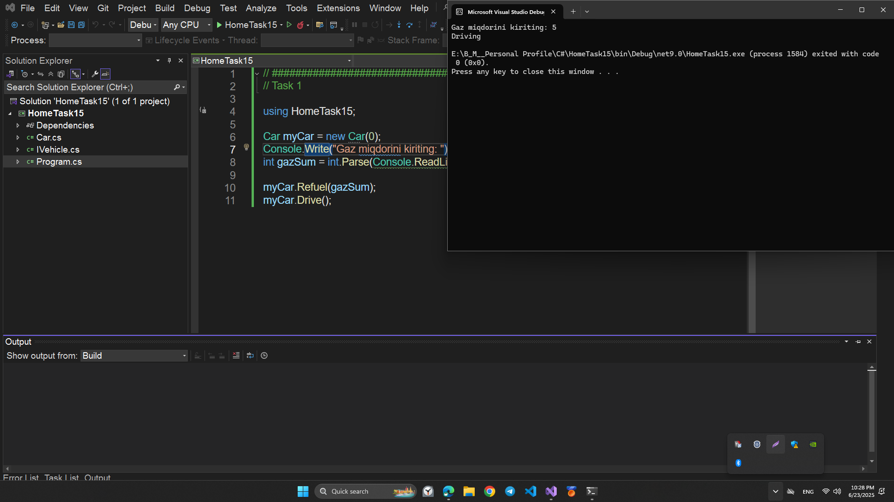
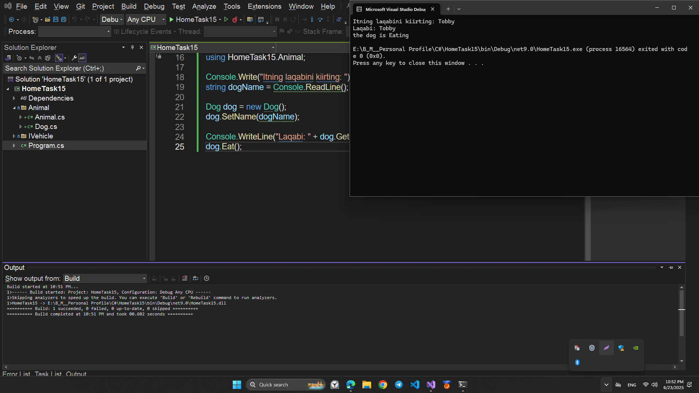
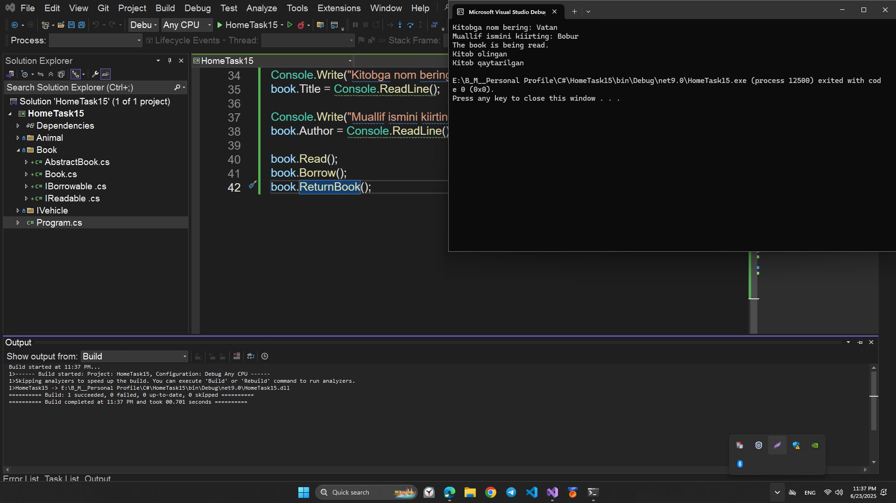

# HomeTask15

## This program is written in C# and performs the following function:

## INTERFACE

# Topics

```
1. C# INTERFACE
2. C# ABSTRACT VS INTERFACE
```

# Program performance

## Task1

Create a C# program that implements an IVehicle interface with two methods:

- `Drive`: type `void`
- `Refuel`: type `bool`

The `Refuel` method should accept an integer parameter indicating the amount of gasoline to refuel.

Next, create a `Car` class with a constructor that takes the car's starting gasoline amount as a parameter.  
The `Car` class should implement the `Drive` and `Refuel` methods.

The `Drive` method should print "Driving" to the screen if the amount of gasoline is greater than 0.

The `Refuel` method should increase the car's gasoline and return `true`.

To test the program, create an object of type `Car` with 0 gasoline in the `Main` method.  
Prompt the user for the amount of gasoline to refuel, and then execute the `Drive` method of the car.

## 💻 Sample Code Screenshot



## Task2

Create a C# program that implements an abstract class `Animal` that has a `Name` property of type `string` and three methods:  
`SetName(string name)`,  
`GetName()`, and `Eat()`.  
The `Eat()` method will be an abstract method of type `void`.

You will also need to create a `Dog` class that implements the above `Animal` class and overrides the `Eat()` method to print `"the dog is Eating"`.

To test the program, ask the user for a dog name. Create a new `Dog` object from the `Main` method of the program,  
give the `Dog` object a name, and then execute the `GetName()` and `Eat()` methods.

## 💻 Sample Code Screenshot



## Task3

You are developing a library management application.
You need to create a `Book` class that will represent a book in the library.
In addition, you have two interfaces: `Readable` and `Borrowable`.

Each book must have the following properties:

- `Title` (string) - the title of the book.
- `Author` (string) - the author of the book.

The `Readable` interface must contain the following method:

- `void Read()`, which will display a message that the book is being read.

The `Borrowable` interface must contain the following methods:

- `void Borrow()`, which will display a message indicating that the book has been borrowed.
- `void ReturnBook()`, which will print a message indicating that the book has been returned.

Your task:

1. Create an abstract class `AbstractBook`, which will contain the fields `Title` and `Author`, as well as methods for getting and setting the values of these fields.
2. Implement the `Readable` interface in the `AbstractBook` class and define a `Read()` method.
3. Create a class `Book` based on the abstract class `AbstractBook`.
4. Implement the `Borrowable` interface in the `Book` class and define the `Borrow()` and `ReturnBook()` methods.
5. Create an instance of the `Book` class, give it a name and author, and call the `Read()`, `Borrow()` and `ReturnBook()` methods.

## 💻 Sample Code Screenshot


