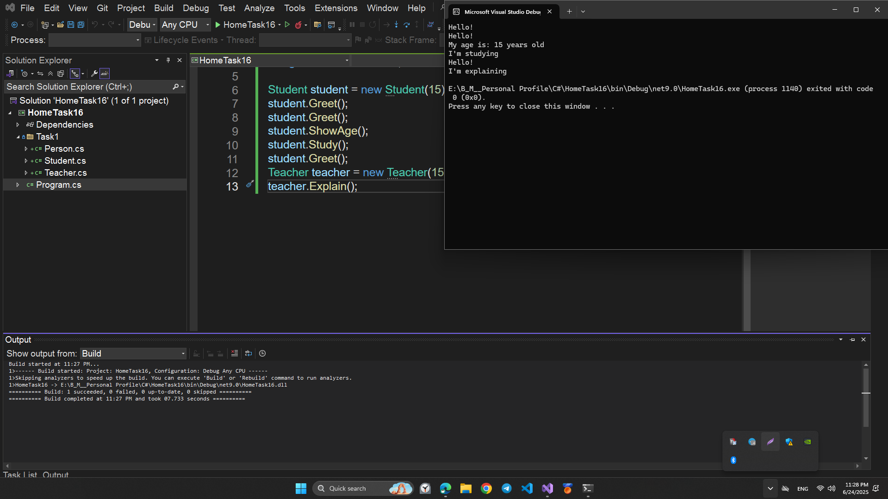
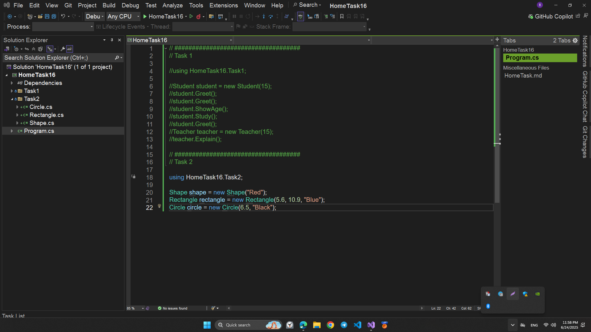

# HomeTask16 – OOP Practice in C#

Bu loyiha `HomeTask16` nomi bilan uchta alohida OOP masalalar to‘plamidan iborat. Har bir topshiriqda real hayotdagi ob’ektlar va ularning C# orqali model qilinishi ko‘rsatilgan.

## 🧩 Topshiriqlar tarkibi

---

### ✅ Task 1 – Person, Student, Teacher

Bu bo‘limda 3 ta class yaratilgan:

- `Person`: Barcha odamlar uchun umumiy class. U `Greet()` va `SetAge()` metodlariga ega.
- `Student`: `Person`dan meros oladi. `Study()` va `ShowAge()` metodlari mavjud.
- `Teacher`: `Person`dan meros oladi. `Explain()` metodi mavjud.

🟢 **Ma’lumotlar sinovdan o‘tkaziladi**: `Program.cs` ichida obyektlar yaratilib, metodlar ishlatiladi.

## 💻 Sample Code Screenshot

---

### ✅ Task 2 – Shape, Rectangle, Circle

Bu bo‘limda klassik UML diagrammasi asosida shakllar tuzilmasi yaratilgan:

- `Shape`: Barcha shakllar uchun umumiy class. `color` nomli `private` fieldga ega.
- `Rectangle`: `Shape`dan meros oladi, `length` va `width` atributlariga ega.
- `Circle`: `Shape`dan meros oladi, `radius` atributiga ega.

🟢 Bu classlar faqat strukturani namoyish qiladi, konsolga hech narsa chiqarilmaydi.

## 💻 Sample Code Screenshot

---

### ✅ Task 3 – Smart Home Devices (IDevice interfeysi)

Ushbu bo‘limda interfeyslar va qurilma classlari o‘rganilgan:

#### 🔌 IDevice interfeysi:

- `TurnOn()` – Qurilmani yoqadi
- `TurnOff()` – Qurilmani o‘chiradi

#### 💡 Lamp

- Xususiyatlar: `Brightness`, `Color`
- Maxsus metodlar: `SetBrightness()`, `ChangeColor()`

#### 🌡️ Thermostat

- Xususiyatlar: `Temperature`, `TargetTemperature`
- Maxsus metodlar: `SetTemperature()`, `GetStatus()`

#### 🔒 Lock

- Xususiyat: `IsLocked`
- Maxsus metod: `GetStatus()`
- `TurnOn()` → Qulfni ochadi
- `TurnOff()` → Qulfni yopadi

🟢 `Program.cs` faylida har bir qurilma testdan o‘tkazilgan.

## 💻 Sample Code Screenshot

---

## ▶️ Ishga tushirish

1. Visual Studio yoki .NET CLI orqali loyihani oching
2. `Program.cs` faylni tanlang
3. Loyihani ishga tushiring (Ctrl + F5)

---

## 🛠 Texnologiyalar

- Til: `C#`
- Konsepsiyalar: `OOP`, `Inheritance`, `Abstraction`, `Encapsulation`, `Interface`

---

## 📁 Loyihada papkalar

- `Task1` → Odamlar (Person, Student, Teacher)
- `Task2` → Shakllar (Shape, Rectangle, Circle)
- `Task3` → Smart Home qurilmalari (Lamp, Thermostat, Lock)

---

## 👨‍💻 Muallif

Ushbu kodlar foydalanuvchi tomonidan C# OOP nazariy bilimlarni amalda mustahkamlash uchun yozilgan.
