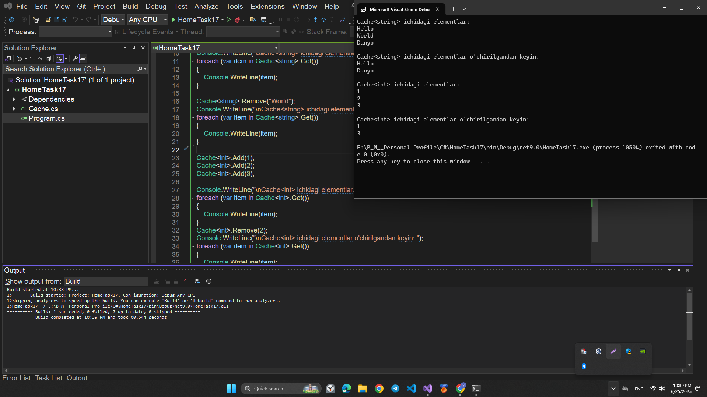
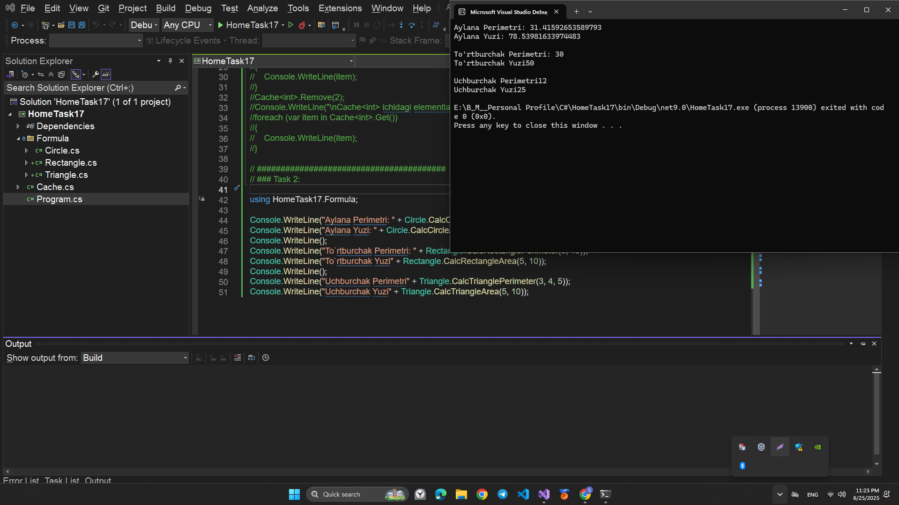
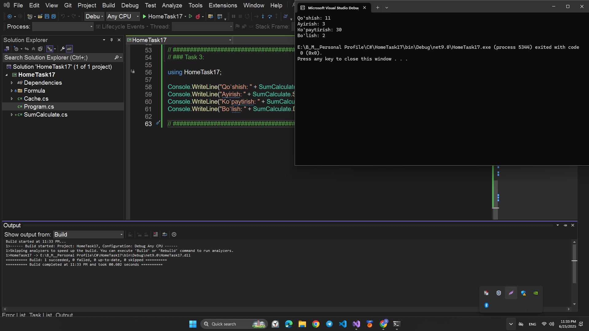

# HomeTask17

## This program is written in C# and performs the following function:

## STATIC CLASSES AND GENERICS

# Topics

```
1. C# STATIC CLASSES
2. C# GENERICS
```

# Program performance

## Task1:

Imagine you create a generic container class called `Cache`,
which can store any objects and provides caching and access to them.
You need to implement this using a static class and generics.
Requirements:

1. The `Cache<T>` class must be static so that it can be accessed without having to create an instance.
2. The `Cache<T>` class must have `Add`, `Get` and `Remove` methods to add, get and remove an object, respectively.
3. The `Cache<T>` class must use generics to support storing any type of object.

## 💻 Sample Code Screenshot



## Task2:

🔍 Let's look at a static class for working with geometric shapes:

1. Circle:

   - Method `CalcCircleArea(double radius)`: Takes the radius of a circle and calculates its area
     according to the formula `S=πr²`, where `π` is a mathematical constant and `r` is the radius.
   - Method `CalcCirclePerimeter(double radius)`: Takes the radius of a circle and calculates its perimeter using the formula `P=2πr`.

2. Rectangle:

   - Method `CalcRectangleArea(double length, double width)`: Takes the length and width of the rectangle and
     calculates its area using the formula `S = l * w`, where `l` is length, `w` is width.
   - Method `CalcRectanglePerimeter(double length, double width)`:
     Takes the length and width of a rectangle and calculates its perimeter using the formula `P = 2(l + w)`.

3. Triangle:
   - Method `CalcTriangleArea(base, height)`: Takes the base and height of the triangle and
     calculates its area using the formula `S = 0.5 * b * h`, where `b` is the base, `h` is the height.
   - Method `CalcTrianglePerimeter(double side1, double side2, double side3)`: Takes the lengths of the three sides of a triangle and calculates its perimeter using the formula `P = a + b + c`, where `a`, `b`, `c` are the sides of the triangle.

In this static class, you can call these methods by passing the appropriate parameters,
and get the area and perimeter of the corresponding geometric figure without having to create an instance of the class.

## 💻 Sample Code Screenshot



## Task3:

Creating a static class to work with mathematical functions and defining static methods to perform the operations involves the following steps:

1. Create a static class: Create a class with the `static` modifier so that it can only contain
   static members and did not require creating an instance of the class to call methods.

2. Methods for calculating operations:
   - Sum: Define a static method `Add(a, b)` that takes two numbers `a` and `b` and returns their sum.
   - Difference: Define a static method `Subtract(a, b)` that takes two numbers `a` and `b` and returns their difference.
   - Product: Define a static method `Multiply(a, b)` that takes two numbers `a` and `b` and returns their product.
   - Division: Define a static method `Divide(a, b)` that takes two numbers `a` and `b` and returns their quotient.

By calling these static methods from your static class you will be able to calculate the sum, difference,
product or division of two numbers without having to create an instance of the class.

## 💻 Sample Code Screenshot


