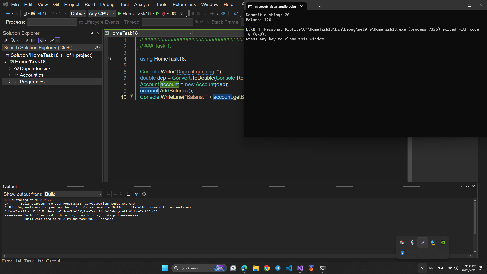
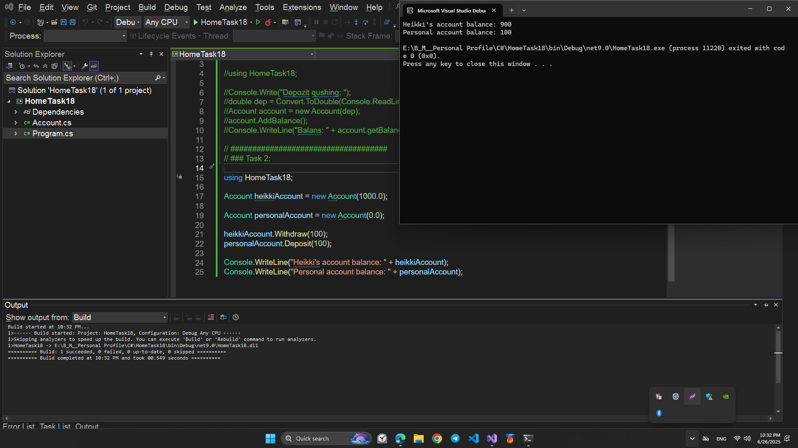
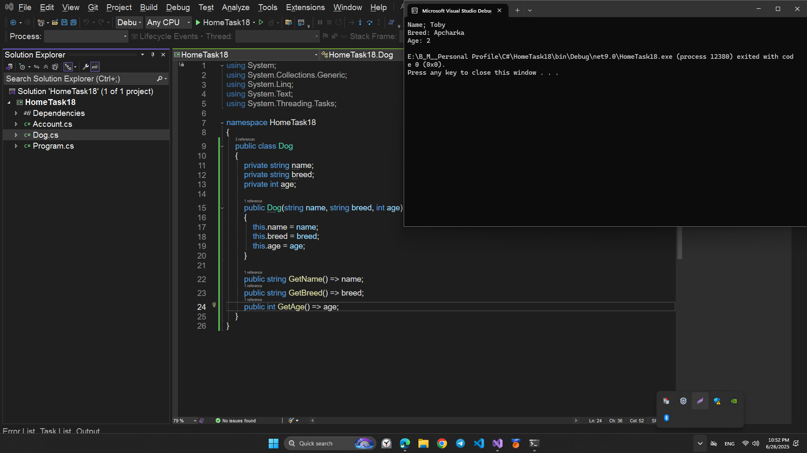
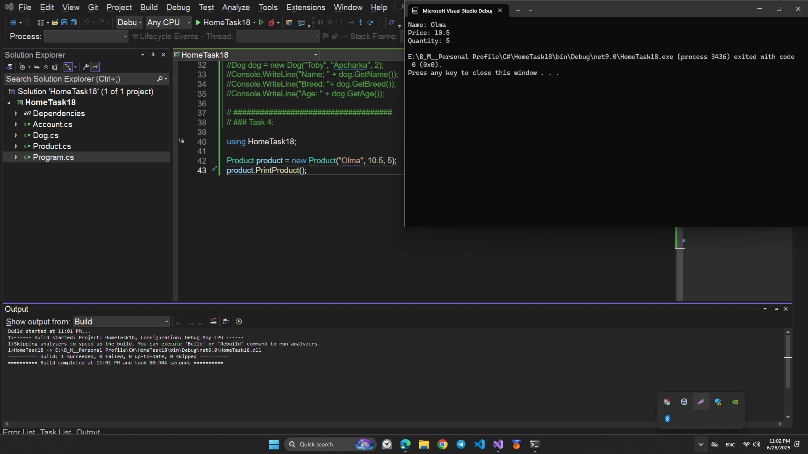
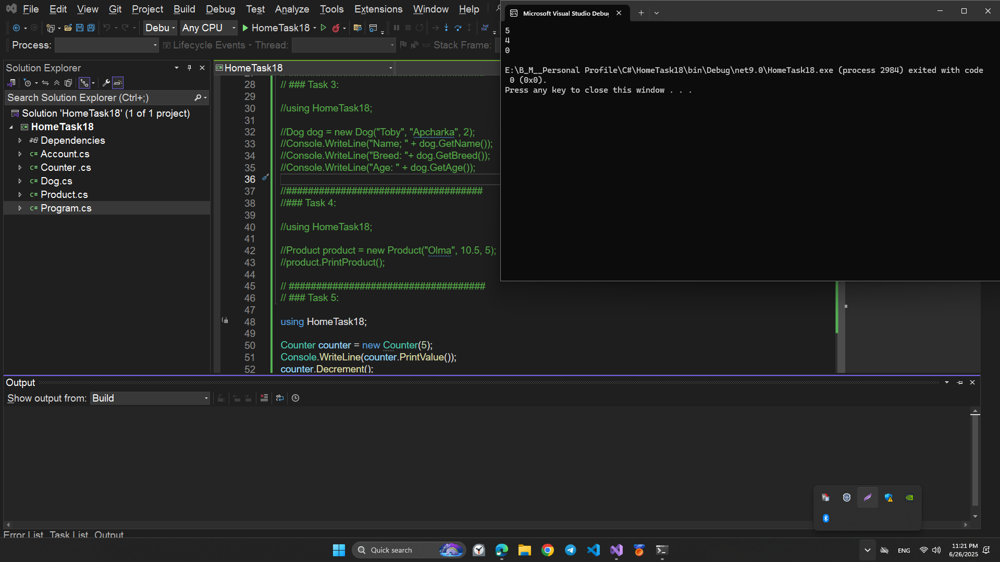

# HomeTask18 - C# OOP Practice

Ushbu loyiha `C#` dasturlash tilida obyektga yo‘naltirilgan dasturlash (OOP) tushunchalarini mustahkamlash uchun yozilgan 5 ta klassdan iborat.

## 📚 Tasks

### 1. `Account` Class

Hisob raqamni ifodalaydi:

- **Field**:
  - `Balance` (private double): hisobdagi pul miqdori.
- **Constructor**:
  - `Account(double balance)` – boshlang‘ich balansni o‘rnatadi.
- **Methods**:

  - `Deposit(double amount)` – hisobga pul qo‘shadi.
  - `Withdraw(double amount)` – hisobdan pul yechadi.
  - `ToString()` – balansni string ko‘rinishida qaytaradi.

  ## 💻 Sample Code Screenshot

  

  

---

### 2. `Counter` Class

Oddiy hisoblagichni ifodalaydi:

- **Field**:
  - `value` (private int): joriy qiymat.
- **Constructor**:
  - `Counter(int value)` – boshlang‘ich qiymatni o‘rnatadi.
- **Methods**:
  - `Decrement()` – qiymatni 1 ga kamaytiradi (agar 0 dan katta bo‘lsa).
  - `Reset()` – qiymatni 0 ga tenglashtiradi.
  - `PrintValue()` – joriy qiymatni qaytaradi.

## 💻 Sample Code Screenshot

---

### 3. `Dog` Class

Itni ifodalaydi:

- **Fields**:
  - `name` (string): itning ismi.
  - `breed` (string): zot(i).
  - `age` (int): yoshi.
- **Constructor**:
  - `Dog(string name, string breed, int age)` – boshlang‘ich ma’lumotlarni o‘rnatadi.
- **Getters**:
  - Har bir field uchun `GetName()`, `GetBreed()`, `GetAge()` metodlari yozilishi mumkin (agar getterlar kerak bo‘lsa).

## 💻 Sample Code Screenshot

---

### 4. `Product` Class

Do‘kon mahsulotini ifodalaydi:

- **Fields**:
  - `name` (string): mahsulot nomi.
  - `price` (double): mahsulot narxi.
  - `quantity` (int): mavjud miqdor.
- **Constructor**:
  - `Product(string name, double price, int quantity)` – boshlang‘ich qiymatlarni belgilaydi.
- **(Optional)**: Get metodlar qo‘shilishi mumkin.

## 💻 Sample Code Screenshot

---

### 5. Strukturaviy Tartib

Har bir klass alohida faylga yozilgan bo‘lishi tavsiya qilinadi (`Account.cs`, `Counter.cs`, `Dog.cs`, `Product.cs`) va kerak bo‘lsa `Program.cs` orqali test qilinishi mumkin.

---

## 💡 Maqsad

Ushbu topshiriqlar orqali:

- OOP konseptlarini mustahkamlash (Encapsulation, Class, Field, Method).
- Real hayotdagi obyektlarni kodda ifodalash.
- C# dasturlash tilida klasslar bilan ishlash ko‘nikmasini oshirish.

---

## ✅ Foydalanilgan Texnologiyalar

- C# 10
- .NET SDK
- Visual Studio / Visual Studio Code

---
