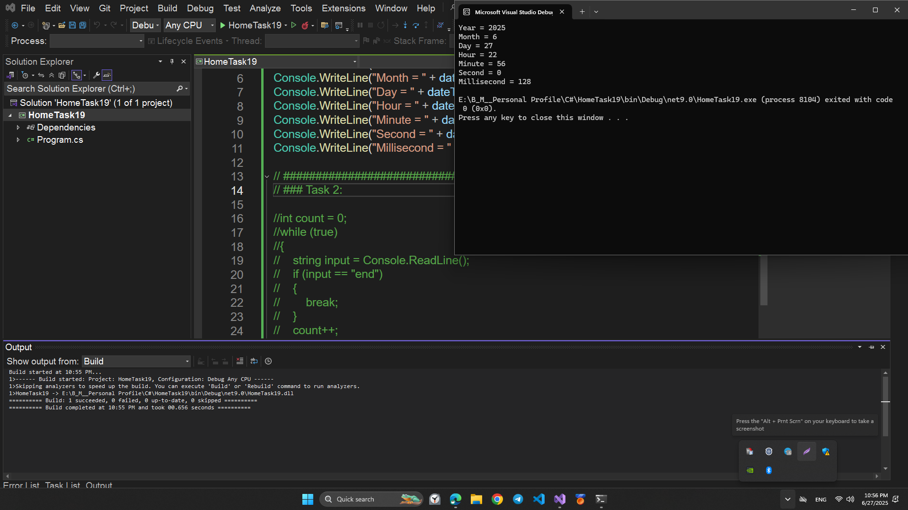
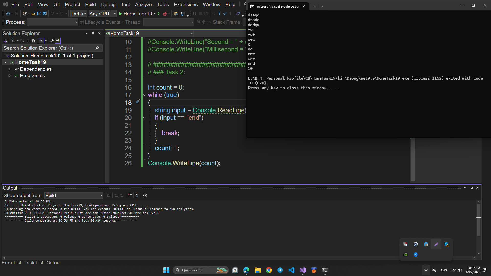
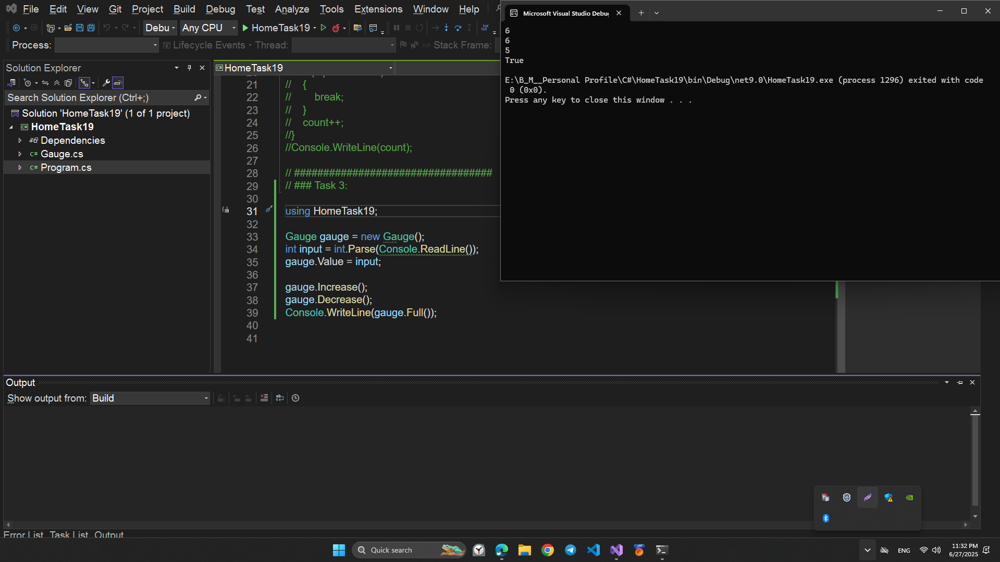
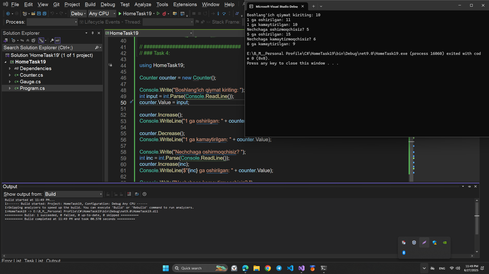
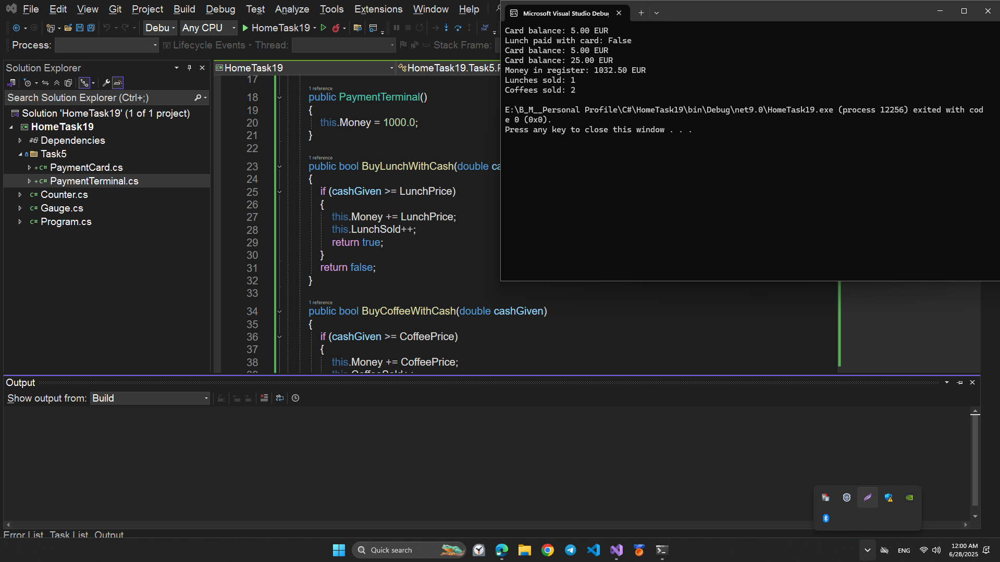

# HomeTask19

## This program is written in C# and performs the following function:

## EXCEPTION HANDLING AND DATETIME

# Topics

```
1. C# EXCEPTION HANDLING
2. C# TRY AND CATCH
3. C# DATETIME
4. C# ENUM
```

# Program performance

## HomeTask 1:

Write a C# Sharp program to display the Day properties (year, month, day, hour, minute, second, millisecond etc.)

## 💻 Sample Code Screenshot



## HomeTask 2: Reading Strings

- Write a program that reads strings from the user until the user inputs the string “end”.
- At that point the program should print how many strings have been read.
- The string “end” should not be included in the number strings read.

## 💻 Sample Code Screenshot



## HomeTask 3: Gauge

Create the class **Gauge**. The gauge has the variable **public int value** and **a constructor without parameters.**  
Constructor sets the initial value of the meter variable to 0.

The class has following three methods.
Firstly **public void Increase()** grows the value instance variable’s value by one. It does not grow the value beyond five.

Secondly **public void Decrease()** decreases the value instance variable’s value by one. It does not decrease the value to negative values.

Thirdly **public bool Full()** returns **True** if the instance variable value has the value five. Otherwise, it returns **False**.

Give the value ability for get and set: **Make the value public rather than private, and add { get; set; } on the declaring lines!**

## 💻 Sample Code Screenshot



## HomeTask 4 : Overloaded Counter

- Implement a class called **Counter**. The class contains a number, whichs value can be increased and decreased.
- The class must have the following constructors.

- **public Counter(int startValue)** sets the start value of the counter to startValue.
- **public Counter()** sets the start value of the counter to 0. And the following methods and properties.

- **public int value { get; set; }**
- **public void Increase()** increases the value by 1
- **public void Decrease()** decreases the value by 1
- **public void Increase(int increaseBy)** increases the value of the counter by the value of increaseBy.
- If the value of increaseBy is negative, the value of the counter does not change.
- **public void Decrease(int decreaseBy)** decreases the value of the counter by the value of decreaseBy.
- If the value of decreaseBy is negative, the value of the counter does not change.

## 💻 Sample Code Screenshot



## HomeTask 5: Card Payments

- In the previous exercise, we created a class called PaymentCard that had methods for eating lunch, drinking coffee, and adding money to the card. However, this implementation had a problem.
- The card knew the prices of the different payments, which meant that any changes in pricing or new items being added would require replacing all existing cards with new ones that are aware of the new prices.

- To solve this problem, we need to make the cards "happy" and only keep track of their balance.
- All the intelligence should be in separate objects, payment terminals.

#### Section 1

- Let's first implement the "happy" version of the PaymentCard.
- The card should only have the ability to ask for the balance, add money, and take money.
- Implement the `TakeMoney` method in the class

#### Section 2

- When visiting a student cafeteria, the customer pays either with cash or with a payment card.
- The cashier uses a payment terminal to charge the card or to process the cash payment. Let's create a terminal that's suitable for cash payments.

#### Section 3

- Let's extend our payment terminal to also support card payments. We are going to create new methods for the terminal.
- It receives a payment card as a parameter and decreases its balance by the price of the meal that was purchased.

#### Section 4

- Let's create a method for the terminal that can be used to add money to a payment card.
- Recall that the payment that is received when adding money to the card is stored in the register (adding cash).

## 💻 Sample Code Screenshot


