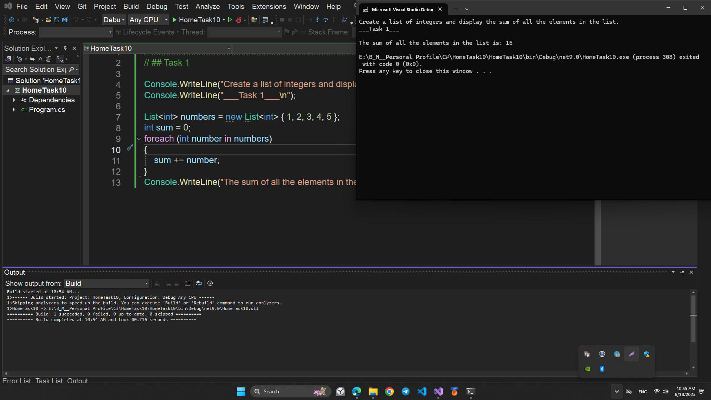
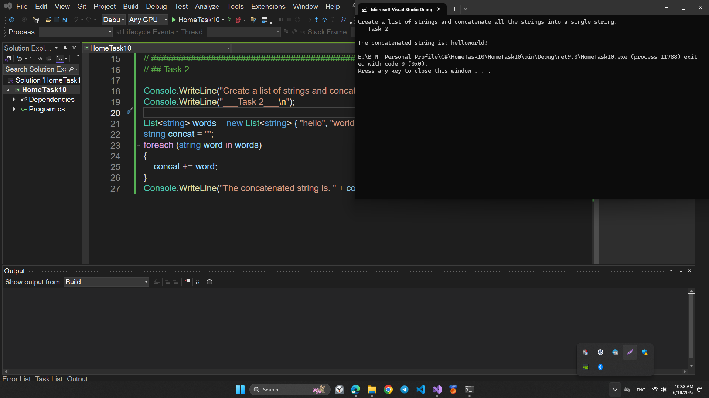
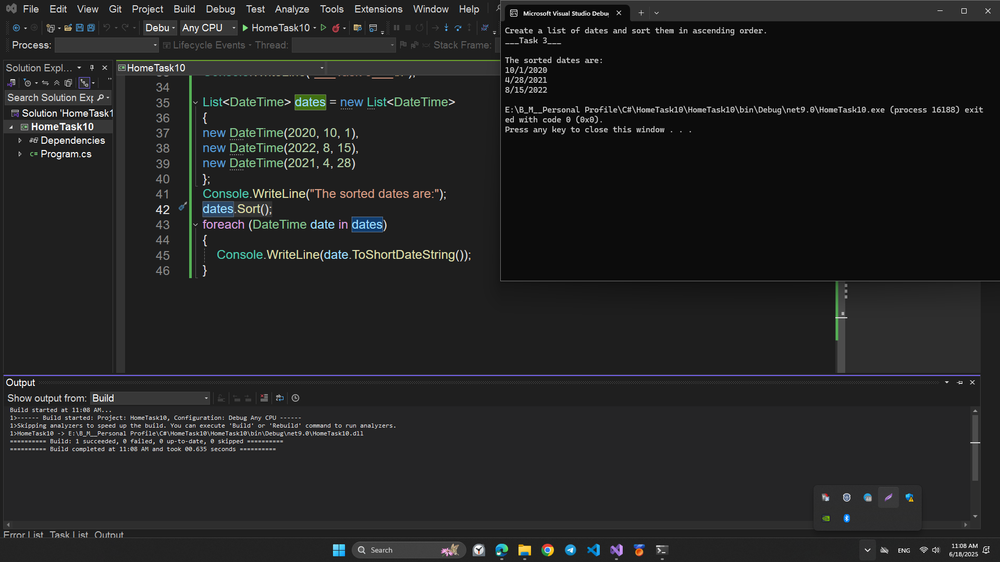
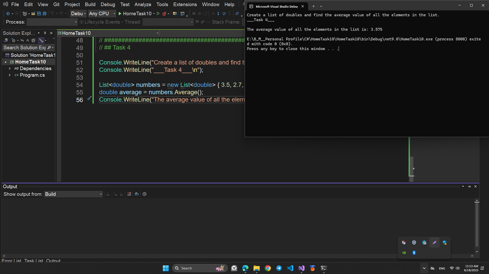
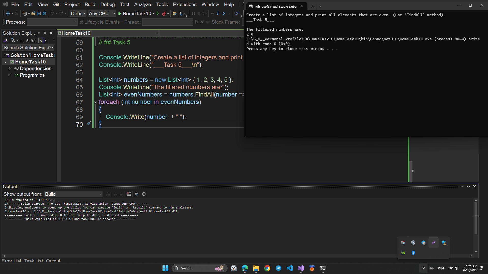
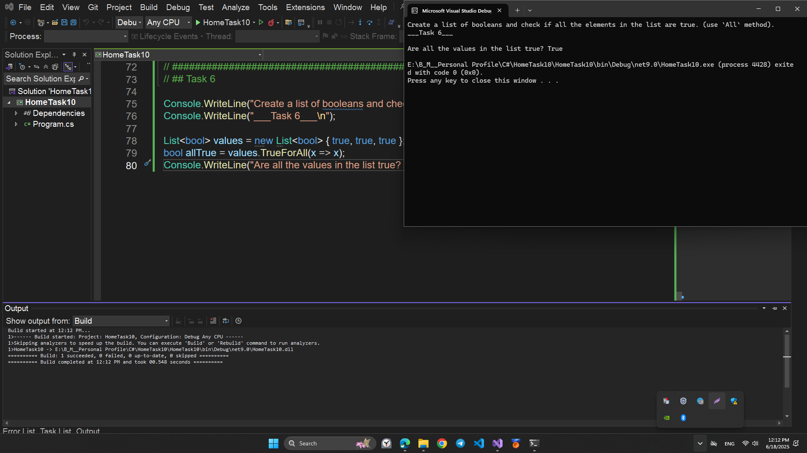
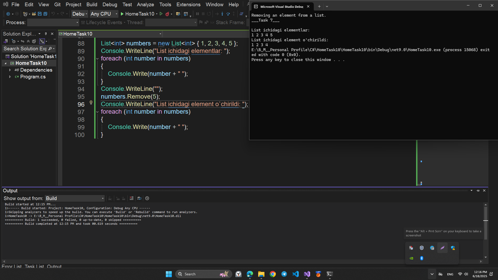
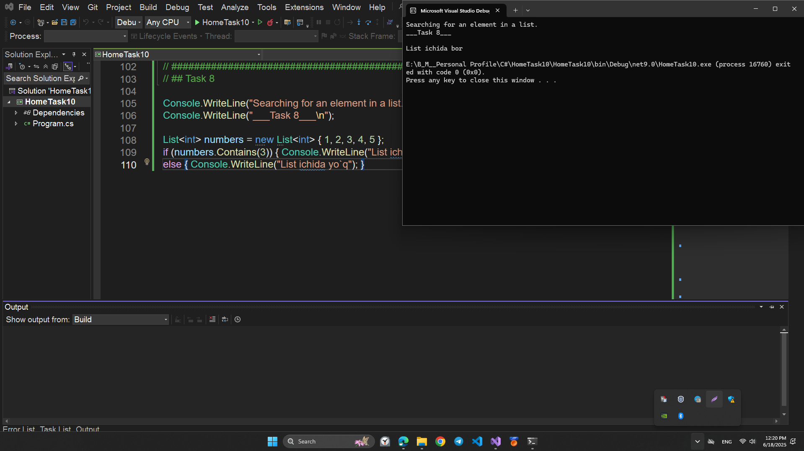
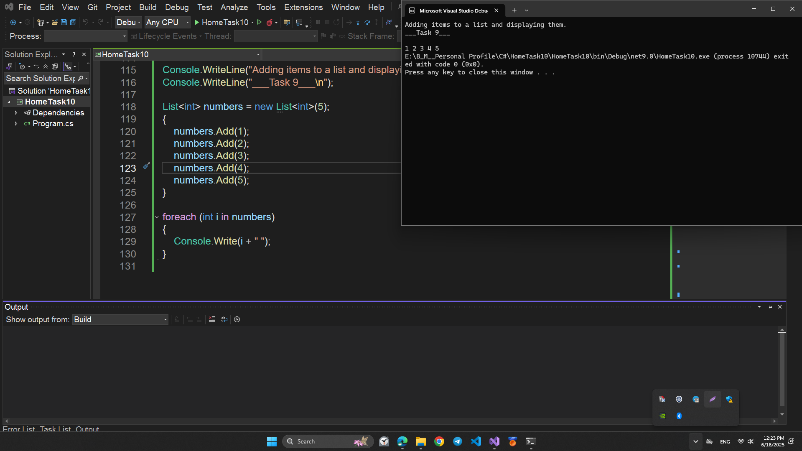
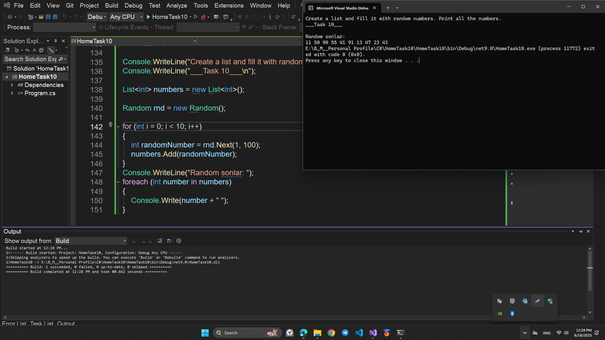

# HomeTask11

## This program is written in C# and performs the following function:

## COLLECTIONS

# Topics

```
1. C# COLLECTIONS
2. C# LIST<T>
```

# Program performance

## Task1

## - Create a list of integers and display the sum of all the elements in the list.

## 💻 Sample Code Screenshot



## Task2

## - Create a list of strings and concatenate all the strings into a single string.

## 💻 Sample Code Screenshot



## Task3

## - Create a list of dates and sort them in ascending order.

## 💻 Sample Code Screenshot



## Task4

## - Create a list of doubles and find the average value of all the elements in the list.

## 💻 Sample Code Screenshot



## Task5

## - Create a list of integers and print all elements that are even. (use `FindAll` method).

## 💻 Sample Code Screenshot



## Task6

## - Create a list of booleans and check if all the elements in the list are true. (use `All`)

## 💻 Sample Code Screenshot



## Task7

## - Removing an element from a list.

## 💻 Sample Code Screenshot



## Task8

## - Searching for an element in a list.

## 💻 Sample Code Screenshot



## Task9

## - Adding items to a list and displaying them.

## 💻 Sample Code Screenshot



## Task10

## - Create a list and fill it with random numbers. Print all the numbers.

## 💻 Sample Code Screenshot


