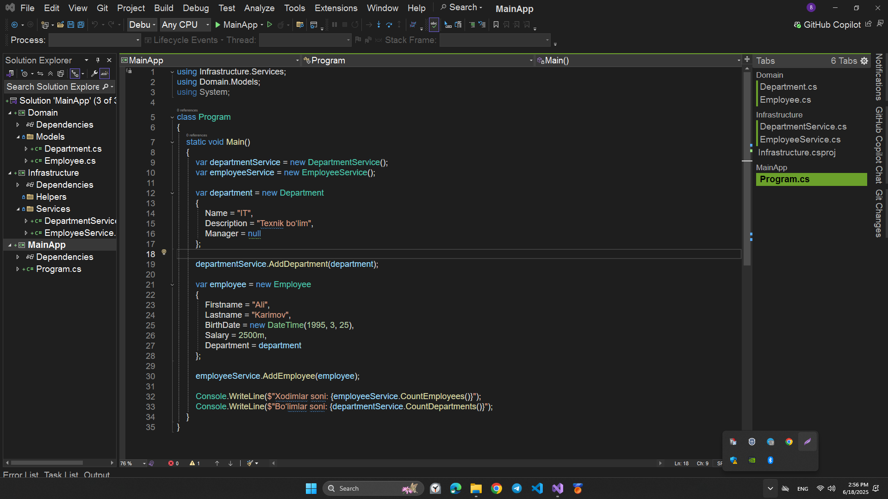
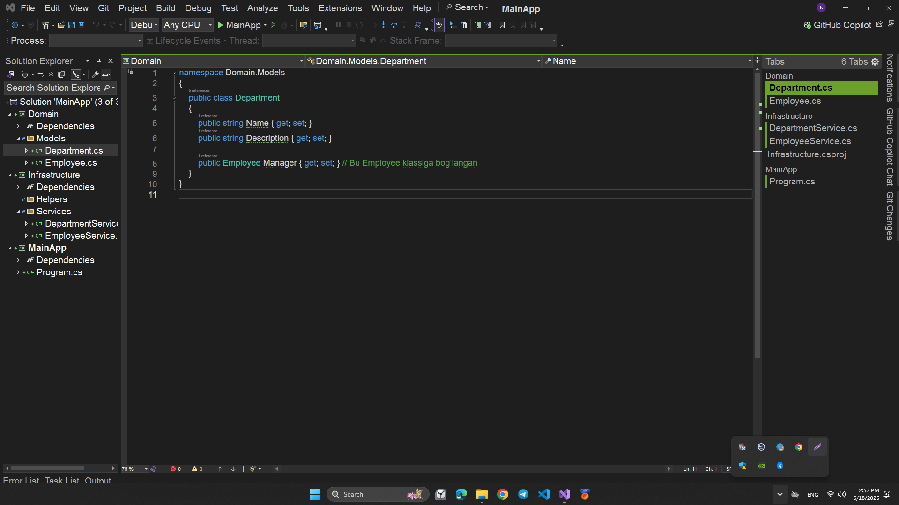
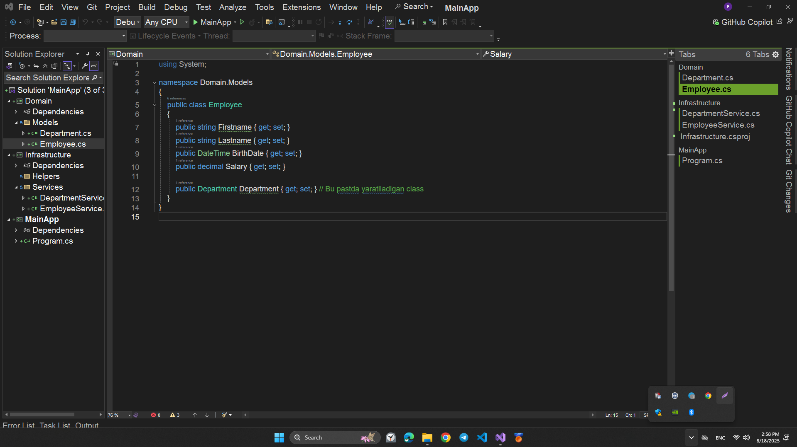
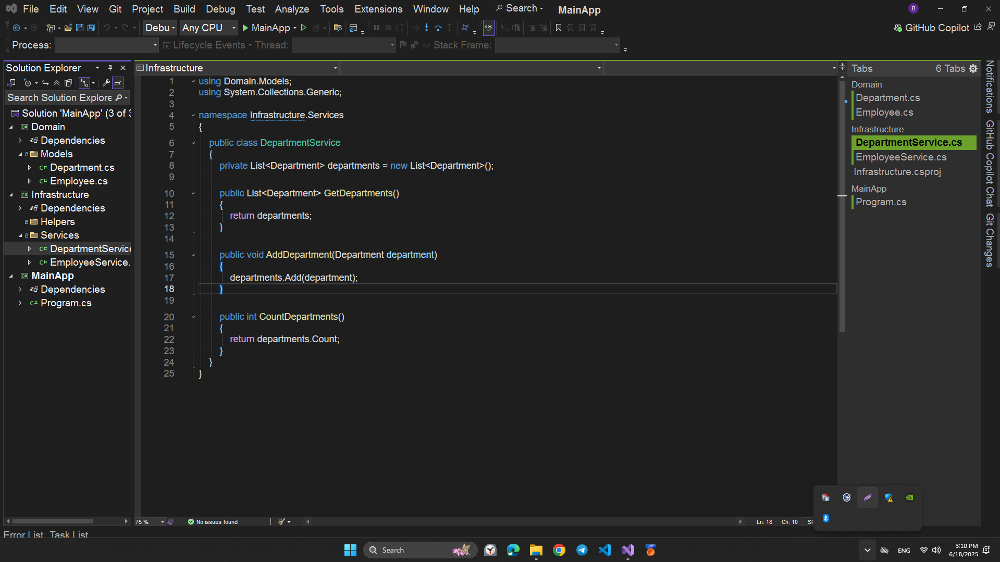
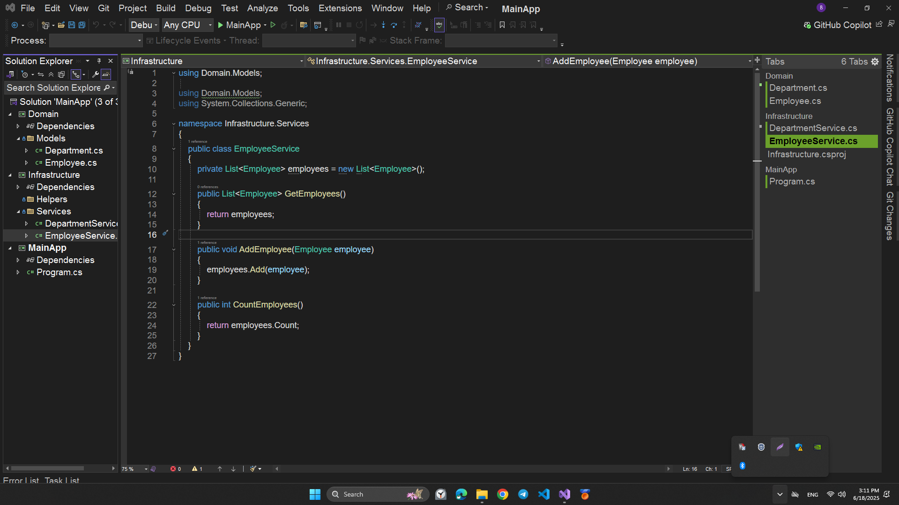
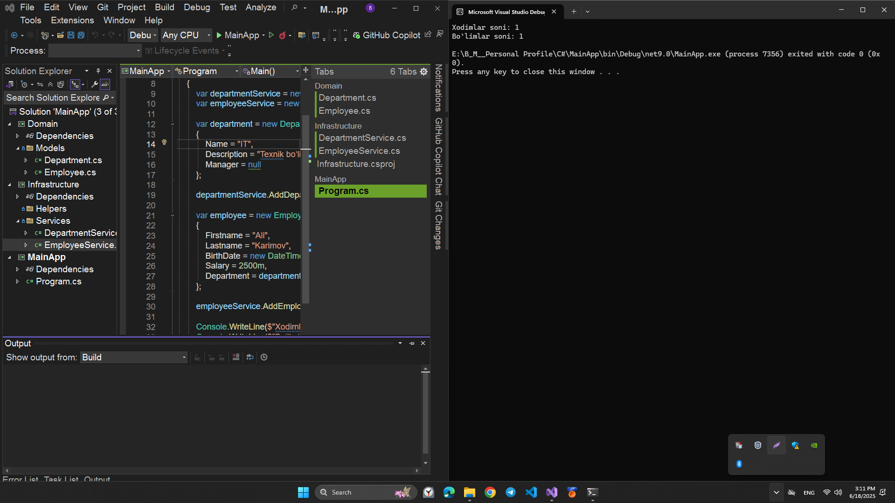

# 🧩 Softclub Employee Management Console App

Bu loyiha **konsol ilovasi** bo‘lib, xodimlar (`Employee`) va bo‘limlar (`Department`)ni saqlash, qo‘shish va hisoblash imkonini beradi. Loyiha **uch qatlamli arxitekturaga** asoslangan: `MainApp`, `Infrastructure`, va `Domain`.

## 📦 Loyiha Tuzilmasi

> `MainApp` **arxitektura**

> `Domain` **arxitektura**

> `Department.cs` > 

> `Employee.cs` > 

> `Infrastructure` **arxitektura**

> `DepartmentService.cs` > 

> `EmployeeService.cs` > 

> `Program.cs` => **natija**
> 

---

## 🧠 Funksiyalar

### 👤 EmployeeService

- `List<Employee> GetEmployees()`
- `void AddEmployee(Employee employee)`
- `int CountEmployees()`

### 🏢 DepartmentService

- `List<Department> GetDepartments()`
- `void AddDepartment(Department department)`
- `int CountDepartments()`

---

## 🛠 Ishga tushurish

1. Visual Studio yoki Rider orqali `Softclub.sln` faylini oching.
2. **MainApp** loyihasini asosiy loyihaga (`Set as Startup Project`) belgilang.
3. Ilovani `Run` tugmasi bilan ishga tushiring.

---

## 🔧 Texnologiyalar

- C# (.NET 9.0)
- Console App
- 3-layer architecture (Domain, Infrastructure, UI)

---

## 🧑‍💻 Muallif

- **Mengliyev Bobur**
- Email: boburbekmengliyev2025@gmail.com
- Telegram: [@theboburmengliyev](https://t.me/theboburmengliyev)

---

## 📄 Litsenziya

Ushbu loyiha ta’limiy maqsadlarda yaratilgan va erkin foydalanish uchun mo‘ljallangan.
