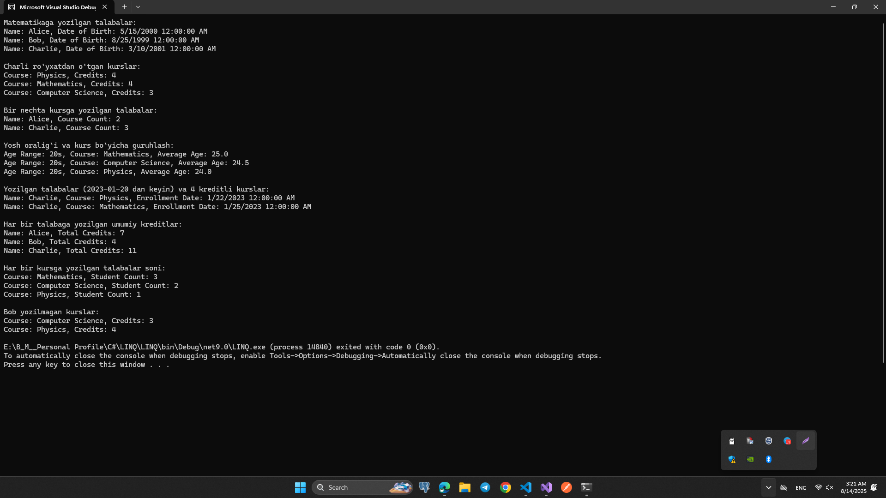
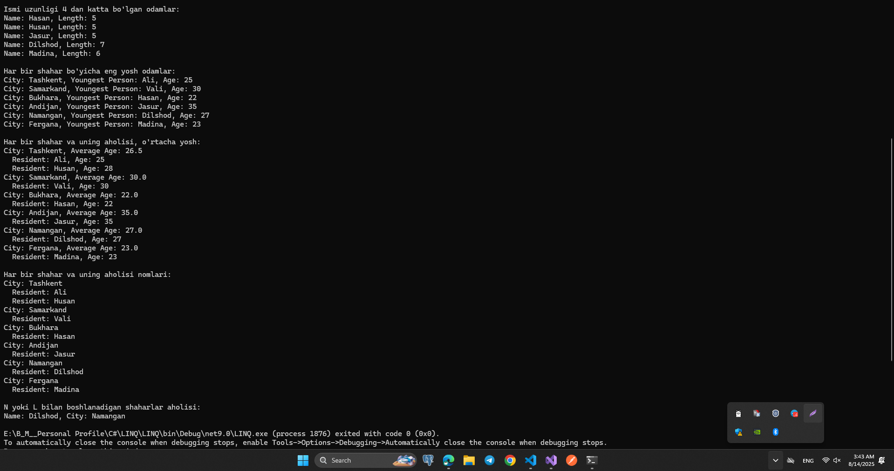

### LINQ Homework Tasks

Bu hujjat ikki alohida LINQ uyga vazifa to'plamini o'z ichiga oladi. Har bir topshiriq massiv yoki ro'yxatlar (array yoki list) bilan ishlash, LINQ yordamida ma'lumotlarni qidirish, guruhlash va filtrlash bo'yicha amaliy mashqlarni o'z ichiga oladi.

## Homework 1 — Student, Course, Enrollment

### Ma'lumotlar modellari

### 1. Student

- Id (int)

- Name (string)

- DateOfBirth (DateTime)

### 2. Course

- Id (int)

- Title (string)

- Credits (int)

### 3. Enrollment

- Id (int)

- StudentId (int)

- CourseId (int)

- EnrollmentDate (DateTime)

## Topshiriqlar

- Mathematics kursiga yozilgan barcha talabalarni toping.

- "Charlie" yozilgan barcha kurslarni toping.

- SelectMany bilan bir nechta kursga yozilgan talabalarni aniqlash.

- Talabalarni yosh oralig'i bo'yicha guruhlab, kurslar kesimida o'rtacha yoshni hisoblash.

- Student, Enrollment va Course jadvalini birlashtirib, ro'yxatdan o'tish sanasi va kreditlar bo'yicha filtrlash.

- Har bir talaba yozilgan jami kreditlarni hisoblash.

- Har bir kursda nechta talaba borligini topish.

- Masalan, “Bob” yozilmagan barcha kurslarni topish.

## Natijalar

## Homework 2 — Person, City

### Ma'lumotlar modellari

### 1. Person

- Id (int)

- Name (string)

- Age (int)

- CityId (int)

### 2. City

- Id (int)

- Name (string)

## Topshiriqlar

- Ism uzunligi 4 dan katta bo‘lgan odamlarni toping va ism bilan uzunligini chiqarish.

- Odamlarni shahar bo'yicha guruhlab, yosh bo'yicha tartiblash va har bir shahardagi eng yosh odamni tanlash.

- Har bir shahar aholisidan iborat iyerarxik tuzilma tuzish va o'rtacha yoshni hisoblash.

- People va City ni join qilib, shahar nomi va aholi ro'yxatini chiqarish.

- Nomlari ‘N’ yoki ‘L’ harfi bilan boshlanadigan shaharlarda yashovchilarni topish va ism + shahar nomini chiqarish.

## Natijalar

## Ishlash tartibi

- C# konsol loyihasi yarating.

- Kerakli classlarni e'lon qiling.

- Ma'lumotlarni List<T> yoki massivga kiriting.

- Har bir topshiriqni LINQ yordamida bajaring.

- Natijalarni Console.WriteLine bilan konsolda chiqarib boring.
