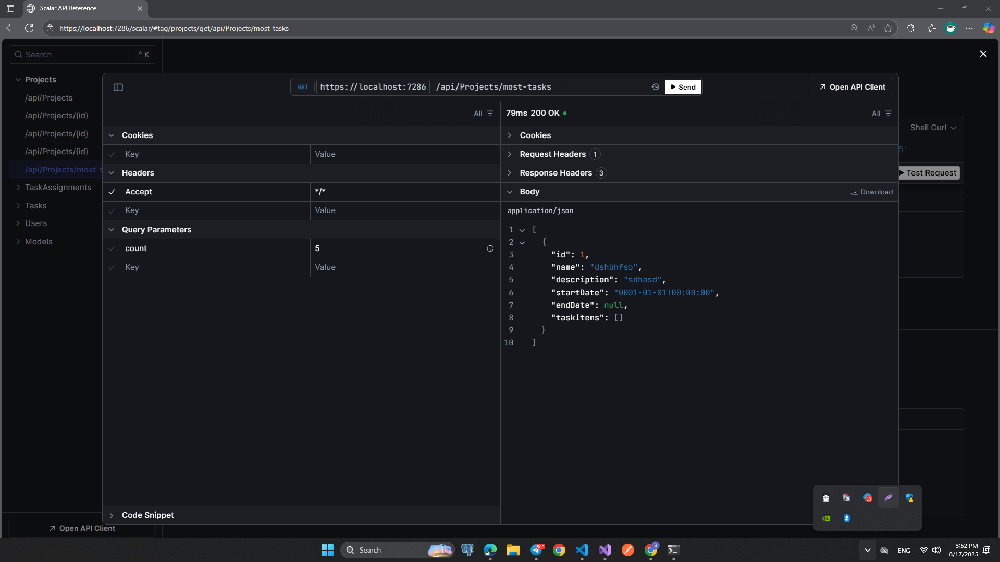

# Task Management System (ASP.NET Core + EF Core + PostgreSQL)

Bu repoda Project / Task (TaskItem) / User / TaskAssignment enti tilari asosida CRUD va kengaytirilgan LINQ so‘rovlari bilan ishlaydigan backend xizmati mavjud. Arxitektura: Controllers → Services → EF Core (DbContext) → PostgreSQL.

> Eslatma: “Task” entity nomi .NETdagi System.Threading.Tasks.Task bilan chalkashmasligi uchun TaskItem deb atalgan.

### Texnologiyalar

- .NET 8 (ASP.NET Core Web API)

- Entity Framework Core

- Npgsql (PostgreSQL provider)

- Swagger / Scalar.AspNetCore

### Ishlashi:

## Projects

## Users

## Tasks

### ...
