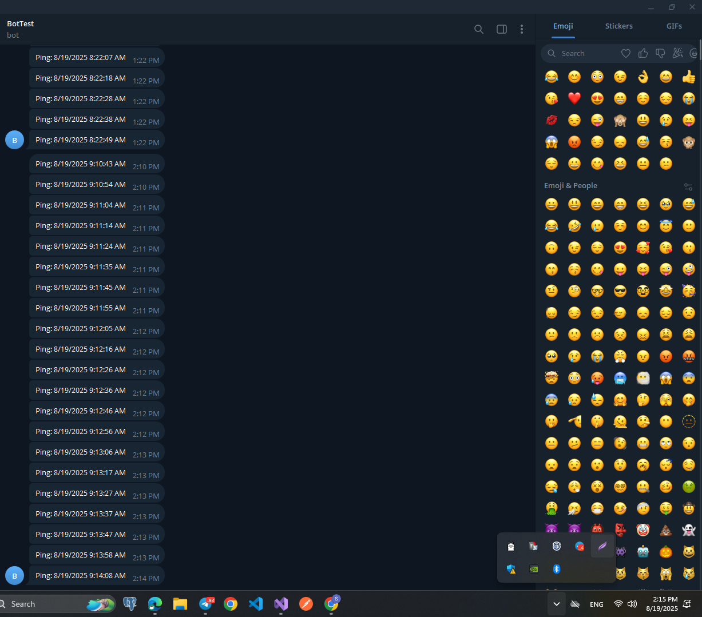

## Telegram Notifier (ASP.NET Core + IHostedService + Dapper + PostgreSQL)

> Ushbu loyiha ASP.NET Core da yozilgan bo'lib, Telegram Bot orqali har 10 soniyada o'zi-o'ziga xabar yuboradi. Yuborilgan xabarlar PostgreSQL bazasida Dapper yordamida saqlanadi. Shuningdek, boshqa bir fon xizmati (BackgroundService) yordamida 2 minutdan so'ng eski xabarlar avtomatik o'chiriladi.

## Texnologiyalar

1. ASP.NET Core 9.0

2. Telegram.Bot

3. Dapper

4. PostgreSQL

5. IHostedService (BackgroundService)

> ### TelegramNotifier/

- Data/

> - INotificationRepository.cs
> - NotificationRepository.cs

- Models/

  > - Notification.cs
  > - TelegramSettings.cs

- Services/

  > - CleanupService.cs
  > - TelegramNotifierService.cs

- Controllers/

  > - NotificationsController.cs

- appsettings.json
- Program.cs
- Pictures
- Readme.md
- .gitignore

```sql
CREATE DATABASE "TelegramNotifier";
```

### PostgreSQL sozlamalari

```sql
CREATE TABLE notifications (
    id BIGSERIAL PRIMARY KEY,
    content TEXT NOT NULL,
    sentatutc TIMESTAMP WITH TIME ZONE NOT NULL
);
```

### Pictures

# Xabar yuborildi va 1 ta habar o'chirildi:


# Xabar yuborildi va 6 ta habar o'chirildi:


# Bazadan tekshirish Id 20 dan boshlandi demak 19 ta habar o'chdi:


# Telegramdan tekshiruv:


